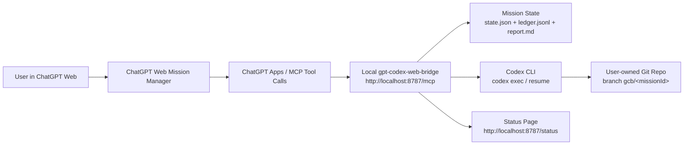

# gpt-codex-web-bridge

[](https://github.com/yo20ywork-max/gpt-codex-web-bridge/actions/workflows/ci.yml)

ChatGPT Web as the mission manager. Codex as the coding worker.

Say one thing in ChatGPT. The bridge lets Codex code, test, repair, checkpoint, pause on usage limits, and resume when you say "continue".

`gpt-codex-web-bridge` is a local-first open-source MVP for connecting ChatGPT Web to Codex CLI through the official ChatGPT Apps / MCP route. It does not automate the ChatGPT DOM, scrape ChatGPT conversations, store passwords, cookies, browser session tokens, OpenAI API keys, or OpenAI credentials, and it does not bypass rate limits.

## Try It Fast

15-second local mock demo:

```bash
npm run mock-demo
```

Fresh clone first:

```bash
npm ci
```

60-second real Codex smoke test: [`docs/REAL_CODEX_SMOKE_TEST.md`](docs/REAL_CODEX_SMOKE_TEST.md)

ChatGPT Web connection test: [`docs/CHATGPT_WEB_CONNECTION_TEST.md`](docs/CHATGPT_WEB_CONNECTION_TEST.md)

Safety disclaimer: the bridge instructs Codex not to read secrets and blocks/reports forbidden files if they appear in git diff. The current MVP does not provide OS-level file-read prevention. Use Codex sandbox/approval settings and avoid running missions on repos containing production secrets.

Terminal transcript:

```text
> npm run mock-demo
status: completed
loop: 2/4
validation: passed
report: .gpt-codex-web-bridge/missions/<missionId>/report.md
```

## Architecture



## Quickstart

```bash
npm install
npm run build
npm run dev
```

Open:

```text
http://localhost:8787/status
```

Run the full mock demo without using real Codex:

```bash
npm run mock-demo
```

Run the quota/rate-limit resume demo:

```bash
npm run demo:rate-limit
```

## Connect ChatGPT Web

Start the local bridge:

```bash
npm run dev
```

Expose it with a tunnel:

```bash
npx localtunnel --port 8787
```

Or:

```bash
npx cloudflared tunnel --url http://localhost:8787
```

In ChatGPT Developer Mode / Apps / Connectors, add the MCP endpoint:

```text
https://your-tunnel-url.example/mcp
```

If ChatGPT asks for tool-call approval, approve bridge tool calls only for repositories you own and intend to modify.

## ChatGPT Web Prompt

Paste this into ChatGPT Web after connecting the MCP server:

```text
You are the web ChatGPT mission manager for gpt-codex-web-bridge.

When I give you a software development goal, use the connected gpt-codex-web-bridge tools to execute it through Codex.

Default behavior:
- Start a mission if no mission is active.
- Continue the latest paused mission if I say 'continue', '繼續', '接著做', or similar.
- Keep calling status/report tools until you know whether the mission is running, completed, paused, blocked, or failed.
- Do not ask me to micromanage Codex.
- Do not request secret values.
- Do not ask Codex to bypass limits.
- If the bridge reports rate_limit_or_quota, tell me the mission was safely paused and that I can say 'continue' later.
- If the bridge reports completed, summarize the result, changed files, validation status, and risks.
- If the bridge reports blocked, summarize the exact blocker and the safest next action.

When starting a mission, call start_mission with:
- goal: my requested task
- repoPath: the repo path I provide
- maxLoops: 12
- autoContinue: true
- allowEnvRead: false

When continuing, call continue_mission with the latest mission id if known; otherwise omit missionId so the bridge resumes the latest paused mission.
```

Then ask ChatGPT:

```text
Use gpt-codex-web-bridge to implement Google OAuth in C:\Users\me\project, run tests, fix failures, pause if usage limit is reached, and resume when I say continue.
```

## Local CLI Prompt

Use the bridge without ChatGPT:

```bash
node dist/cli.js start --repo C:\path\to\repo --goal "Implement Google OAuth, run tests, fix failures, and pause on usage limits." --test "npm test"
```

Check status:

```bash
node dist/cli.js status
```

Read the report:

```bash
node dist/cli.js report
```

Continue the latest paused mission:

```bash
node dist/cli.js continue
```

## Quota / Rate-Limit Pause Example

Mock a usage-limit pause:

```bash
npm run demo:rate-limit
```

Expected behavior:

```text
mission_started
codex_working
rate_limit_detected
mission_paused
user_resumed
mission_completed
```

When real Codex output includes text such as `rate limit`, `quota`, `usage limit`, `429`, `too many requests`, or `limit reached`, the worker saves a checkpoint and pauses with:

```text
pauseReason: rate_limit_or_quota
```

## Resume Example

From ChatGPT Web:

```text
continue
```

From the CLI:

```bash
node dist/cli.js continue
```

The bridge resumes the latest paused mission when no mission id is supplied. It prefers Codex resume when possible and falls back to a compact resume prompt built from mission state, ledger events, git diff, and validation logs.

## Status Page

The static local status widget is available at:

```text
http://localhost:8787/status
```

It shows:

- mission id
- status
- loop count
- validation result
- pause reason
- next action
- changed files count
- risk flags

Mission reports link back to:

```text
http://localhost:8787/status?missionId=<missionId>
```

## MCP Tools

- `start_mission`: create a Codex mission for a target git repo.
- `continue_mission`: resume the latest paused mission, or a specific mission id.
- `pause_mission`: pause a mission and gracefully stop its Codex process when possible.
- `get_mission_status`: inspect status, loop count, validation, branch, checkpoint, and next action.
- `list_missions`: list recent missions.
- `get_mission_report`: return `report.md` plus structured summary.
- `get_manager_prompt`: return the ChatGPT-side manager prompt.

## Mission Files

Missions are stored locally:

```text
.gpt-codex-web-bridge/missions/<missionId>/
  state.json
  ledger.jsonl
  report.md
  validation/
  codex/
```

Set `GCB_STORAGE_DIR` to store mission files somewhere else.

## Safety Boundaries

- Official ChatGPT Apps / MCP route only; no ChatGPT DOM scraping.
- The bridge instructs Codex not to read secrets.
- The bridge blocks/reports forbidden files if they are changed in git diff.
- The current MVP does not provide OS-level file-read prevention.
- Users should rely on Codex sandbox/approval settings and avoid running missions on repos containing production secrets.
- The bridge never intentionally stores passwords, cookies, browser session tokens, OpenAI API keys, or OpenAI credentials.
- No rate-limit, quota, approval, safety mitigation, or access restriction bypassing.
- No automatic production deploys.
- No pushes to `main`.
- Work happens on `gcb/<missionId>`.
- Dirty worktrees are blocked instead of stashed or overwritten.
- `.env`, private keys, SSH keys, cloud credentials, kube configs, and credential folders are forbidden in changed git diff by default.
- GitHub Actions workflow changes, dependency changes, auth/payment/permission changes, deleted tests, and weakened assertions are reported as risk flags.

Forbidden file patterns include:

```text
.env
.env.*
**/*.pem
**/*.key
id_rsa
id_ed25519
**/.ssh/**
**/secrets/**
**/credentials/**
**/.aws/**
**/.gcloud/**
**/.kube/**
```

## Validation

If `testCommand` is provided, it is used. Otherwise the bridge attempts to auto-detect:

- `npm test`, `pnpm test`, or `yarn test` from `package.json`
- `pytest`
- `go test ./...`
- `cargo test`

If `lintCommand` is provided, it runs after tests.

If no validation command is found, the mission can still complete, but `report.md` marks validation as `not_run`.

## More Examples

See:

- [`examples/chatgpt-start-message.md`](examples/chatgpt-start-message.md)
- [`examples/chatgpt-continue-message.md`](examples/chatgpt-continue-message.md)
- [`examples/local-cli-demo.md`](examples/local-cli-demo.md)
- [`examples/expected-report.md`](examples/expected-report.md)
- [`examples/transcripts/mock-demo.txt`](examples/transcripts/mock-demo.txt)
- [`examples/transcripts/rate-limit-demo.txt`](examples/transcripts/rate-limit-demo.txt)

## Project Docs

- [`docs/REAL_CODEX_SMOKE_TEST.md`](docs/REAL_CODEX_SMOKE_TEST.md)
- [`docs/CHATGPT_WEB_CONNECTION_TEST.md`](docs/CHATGPT_WEB_CONNECTION_TEST.md)
- [`docs/MCP_INSPECTOR_TEST.md`](docs/MCP_INSPECTOR_TEST.md)
- [`docs/RELEASE_CHECKLIST.md`](docs/RELEASE_CHECKLIST.md)
- [`SECURITY.md`](SECURITY.md)
- [`CONTRIBUTING.md`](CONTRIBUTING.md)
